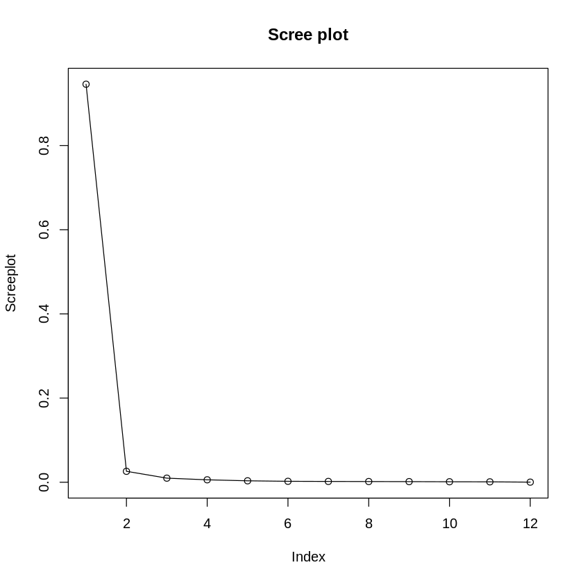
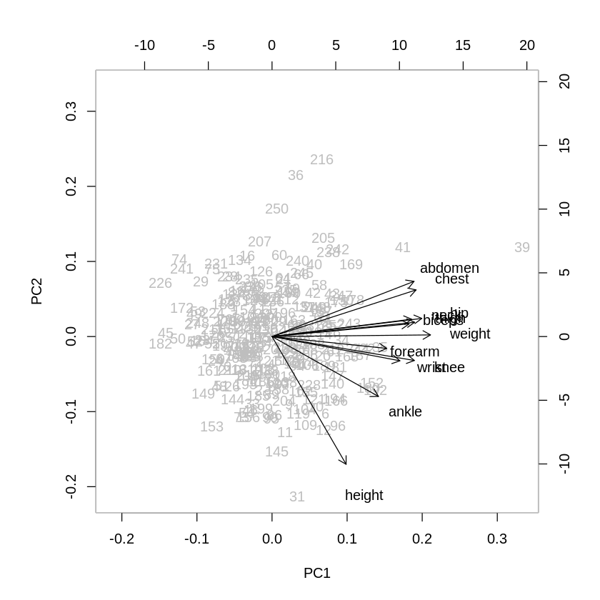

# Body Fat Measurement Analysis using PCA &amp; Exploratory Factor Analysis (EFA)


Statistical analysis of body measurements using **Principal Component Analysis (PCA)** and **Exploratory Factor Analysis (EFA)** in **R**. This project investigates the latent structure of anthropometric variables and identifies the principal dimensions underlying human body composition.

---

## Table of Contents

- Project Overview
- Project Status
- Repository Structure
- Dataset
- Technologies
- Methodology
- Exploratory Data Analysis
- Bartlett's Test
- Principal Component Analysis
- Exploratory Factor Analysis
- Results Summary
- Key Findings
- Installation &amp; Usage
- Future Work
- References
- Author

---

## Project Overview

Human body measurements are often highly correlated. Instead of analyzing each variable individually, this project applies multivariate statistical methods to discover the hidden structure among body measurements.

The analysis includes:

- Data preprocessing
- Correlation analysis
- Bartlett's Test of Sphericity
- Principal Component Analysis (PCA)
- Exploratory Factor Analysis (EFA)
- Interpretation of latent components and factors

---

## Project Status

✅ **Completed**

This project was developed as a statistical multivariate analysis study using R and Google Colab.

---

## Repository Structure

```
.
├── Body_fat.ipynb              # Main notebook (Google Colab - R)
├── dataset/
│   └── bodyfat.csv             # Dataset file
├── vector.png                  # PCA variable vector plot
├── pca_screan_plot.png         # PCA scree plot
└── README.md
```

> **Start here:** `Body_fat.ipynb`

---

## Dataset

The dataset contains measurements from **252 individuals**.

### Variables

- Weight
- Height
- Neck
- Chest
- Abdomen
- Hip
- Thigh
- Knee
- Ankle
- Biceps
- Forearm
- Wrist

The first three columns of the original dataset were removed, and only numeric variables were used for analysis.

---

## Technologies

- **R**
- Google Colab (R Kernel)

### Required Package

```r
install.packages("psych")
library(psych)
```

---

## Methodology

The workflow of this study is illustrated below:

```
Dataset
   │
   ▼
Data Preprocessing
   │
   ▼
Correlation Analysis
   │
   ▼
Bartlett's Test
   │
   ▼
Principal Component Analysis
   │
   ▼
Component Selection
   │
   ▼
Exploratory Factor Analysis
   │
   ▼
Interpretation
```

---

# Exploratory Data Analysis

Before applying dimensionality reduction techniques, covariance and correlation matrices were computed.

The analysis revealed strong positive correlations among several body measurements, particularly:

- Chest
- Abdomen
- Hip
- Weight

These relationships indicate that multivariate techniques are appropriate for this dataset.

---

## Strongest Correlations


| Variables        | Correlation |
| ---------------- | -----------: |
| Weight – Hip     | 0.941       |
| Chest – Abdomen  | 0.916       |
| Hip – Thigh      | 0.896       |
| Weight – Abdomen | 0.888       |


These strong positive correlations indicate substantial redundancy among anthropometric measurements, providing strong motivation for dimensionality reduction using PCA.

---

## Bartlett's Test of Sphericity

```r
cortest.bartlett(bodyfat_corr, n = 252)
```

### Result

- **χ² = 3673.05, p-value ≈ 0**

Since the null hypothesis is rejected, the variables are sufficiently correlated, confirming that both **PCA** and **Factor Analysis** are appropriate.

---

# Principal Component Analysis (PCA)

PCA was performed using the **correlation matrix**.

```r
pca <- princomp(bodyfat, cor = TRUE)
```

---

## Explained Variance


| Component | Variance Explained | Cumulative |
| --------- | ------------------: | ----------: |
| PC1       | 67.9%              | 67.9%      |
| PC2       | 8.7%               | 76.6%      |


The first two principal components explain approximately **76.6%** of the total variance.

---

## Selecting the Number of Components

Three criteria were considered:

- Kaiser Criterion (Eigenvalue &gt; 1)
- Scree Plot
- Cumulative Explained Variance

All three methods consistently suggested retaining **2 principal components**.

---

## Scree Plot
<p align="center">  </p>


The scree plot shows a clear elbow after the second component, indicating that additional components contribute relatively little explanatory power.

---

## PCA Variable Vector Plot
<p align="center">  </p>


### Interpretation

Highly correlated variables (similar directions):

- Abdomen &amp; Chest
- Hip &amp; Biceps
- Wrist &amp; Ankle

Nearly independent variables (approximately 90°):

- Height vs Weight
- Abdomen vs Height
- Wrist vs Knee

Main contributors:

**PC1**

- Weight
- Chest
- Abdomen
- Hip

Represents **overall body size and fat distribution**.

**PC2**

- Height
- Forearm

Represents **body shape and skeletal characteristics**.

---

# Exploratory Factor Analysis (EFA)

Factor analysis was performed using **Maximum Likelihood Estimation (MLE)**.

Among the evaluated solutions, the six-factor model provided the most interpretable structure and captured the main latent dimensions of body composition. Although the likelihood ratio test remained statistically significant (**p = 0.012**), the extracted factors were interpretable and meaningful.

---

## Factor Interpretation

### Factor 1 — Body Fat &amp; Overall Size

Strong loadings:

- Abdomen (**0.868**)
- Chest (**0.837**)
- Weight (**0.733**)
- Hip (**0.728**)

This factor represents **overall body fat and body size**. Variables associated with central body mass contribute most strongly to this dimension.

---

### Factor 2 — Muscularity &amp; Body Proportions

Strong loadings:

- Biceps (**0.658**)
- Forearm (**0.630**)
- Thigh (**0.418**)

This factor captures **muscular development and body proportions**, particularly upper-body muscle measurements.

---

### Factor 3 — Skeletal Structure &amp; Height

Strong loadings:

- Height (**0.866**)
- Wrist (**0.831**)
- Ankle (**0.310**)

This dimension primarily reflects **skeletal characteristics and body height**, distinguishing structural body features from fat-related measurements.

---

### Factor 4 — Mixed Body Characteristics

Moderate loadings:

- Neck (**0.573**)
- Knee (**0.364**)
- Hip (**0.239**)

This factor represents **mixed upper- and lower-body characteristics**, with no single dominant anatomical region.

---

### Factor 5 — Secondary Lower-Body Structure

Main loadings:

- Knee (**0.651**)
- Hip (**0.453**)

This factor captures **secondary lower-body structural variation**, mainly related to knee and hip measurements.

---

### Factor 6 — Extremities

Loadings:

- Wrist (**0.334**)
- Forearm (**0.258**)
- Ankle (**0.203**)

This factor reflects **extremity dimensions**, describing variations in wrist, forearm, and ankle measurements.

---

## Overall Interpretation

The six-factor solution suggests that body measurements can be grouped into distinct latent dimensions:

- **Factor 1:** Body fat and overall body size
- **Factor 2:** Muscularity and body proportions
- **Factor 3:** Skeletal structure and height
- **Factor 4:** Mixed body characteristics
- **Factor 5:** Lower-body structural variation
- **Factor 6:** Extremity measurements

Together, these factors provide a meaningful representation of human body composition while reducing the complexity of the original variables.

---

# Results Summary


| Analysis           | Result                     |
| ------------------ | -------------------------- |
| Bartlett's Test    | χ² = 3673.05, p &lt; 0.001 |
| PCA Components     | 2                          |
| Explained Variance | 76.68%                     |
| EFA Factors        | 6                          |
| Estimation Method  | Maximum Likelihood         |


---

# Key Findings

- PCA reduced the dataset to **2 principal components** explaining approximately **76.6%** of the total variance.
- EFA identified **6 meaningful latent factors** describing body composition.
- Measurements associated with body width (especially **abdomen**, **chest**, and **hip**) contribute most strongly to body fat variation.
- Height forms an independent structural dimension separated from body fat measurements.

---

# Installation &amp; Usage

Clone the repository:

```bash
git clone https://github.com/llazdll/bodyfat.git
```

Open the notebook:

```
Body_fat.ipynb
```

Run the notebook using:

- Google Colab (Recommended)
- R Kernel in Jupyter Notebook

Install required package:

```r
install.packages("psych")
library(psych)
```

---

# Future Improvements

Potential extensions of this work include:

- Applying Confirmatory Factor Analysis (CFA) to validate the extracted latent factors.
- Comparing PCA with Independent Component Analysis (ICA).
- Evaluating different rotation methods such as Varimax and Promax.
- Performing cluster analysis to identify body-type groups.
- Developing predictive models for body fat estimation using anthropometric measurements.

---

# References

- Jolliffe, I. T. (2002). *Principal Component Analysis*.
- Hair, J. F. et al. *Multivariate Data Analysis*.
- Revelle, W. (2024). *psych: Procedures for Psychological, Psychometric, and Personality Research*.

---

## Author

**llazdll**

Data Science &amp; Statistical Analysis Projects  
GitHub: [https://github.com/llazdll](https://github.com/llazdll)